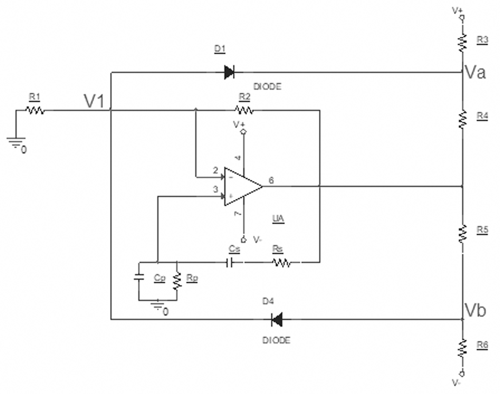
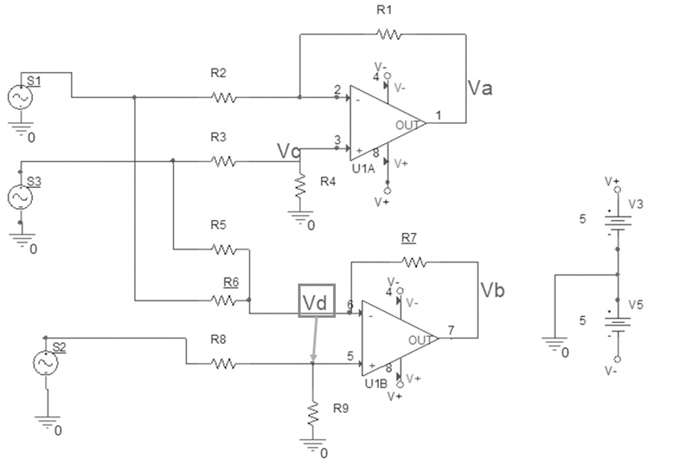
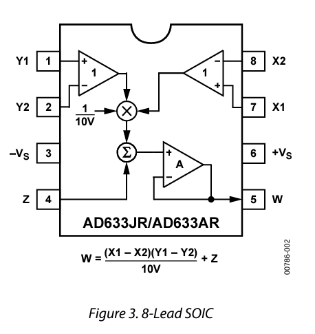
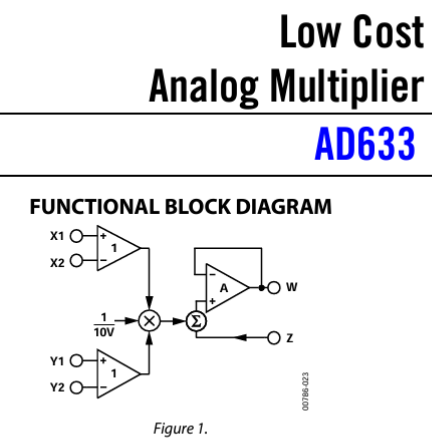
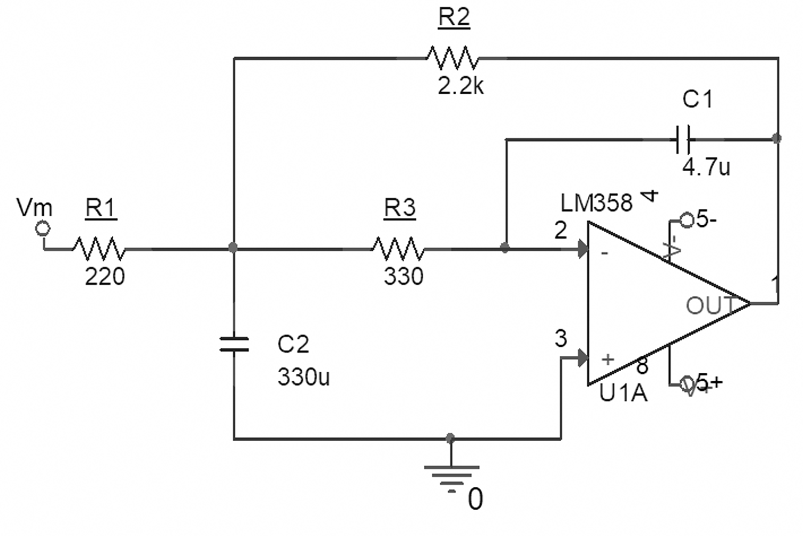
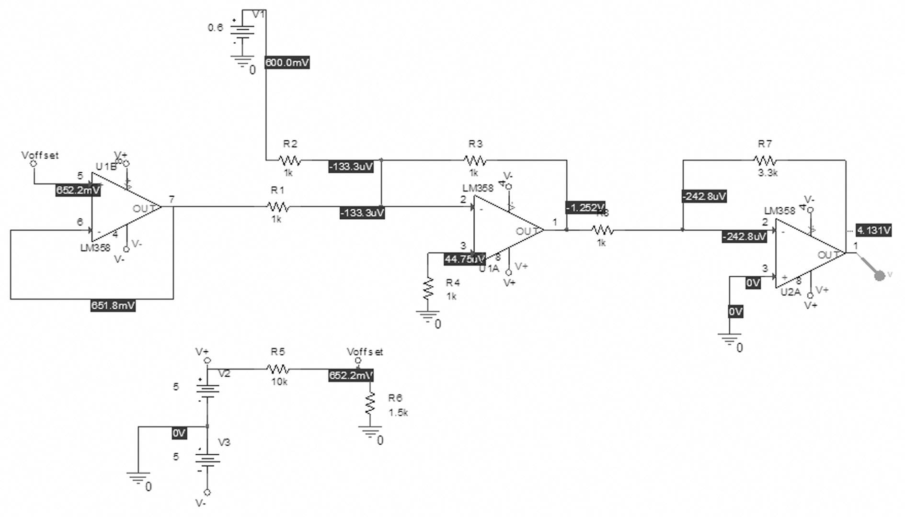
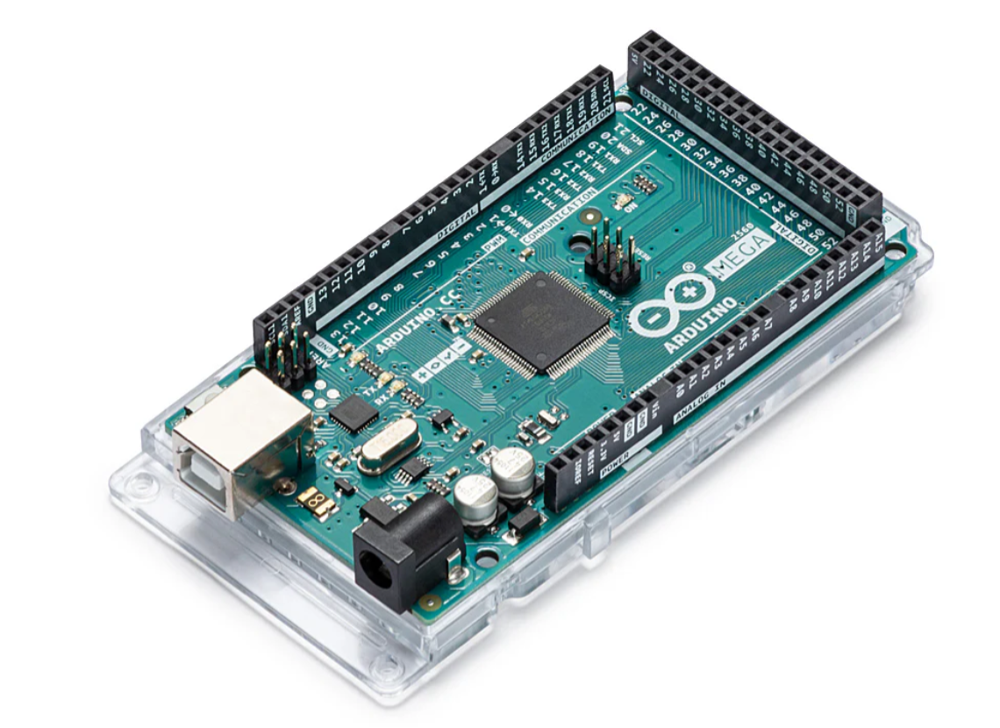
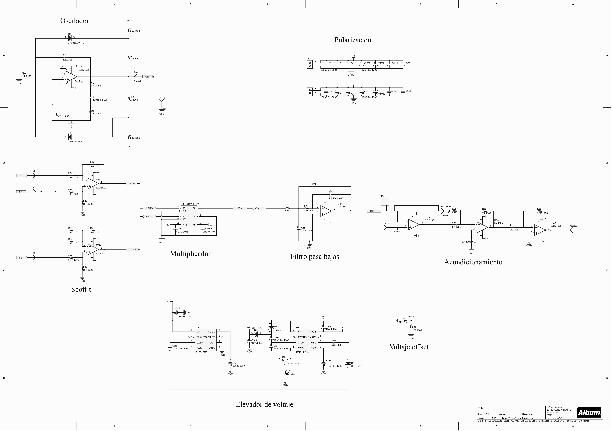
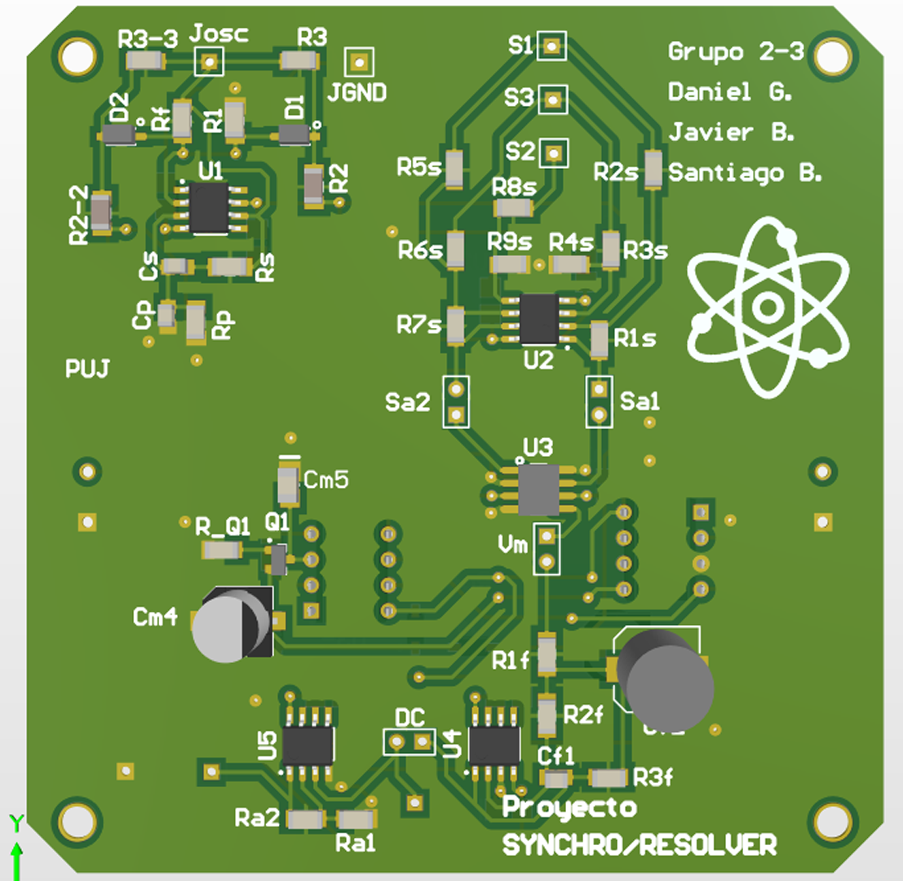
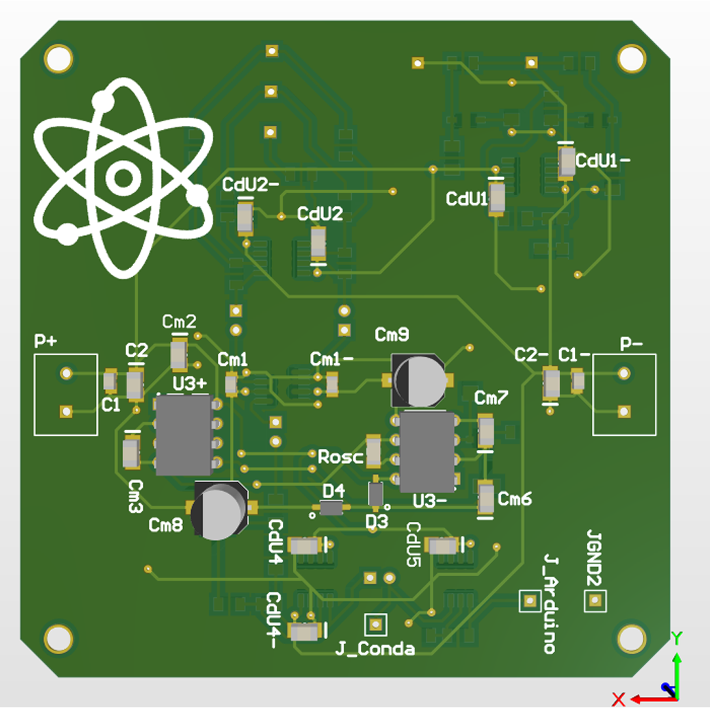

# Medicíon Angular
***Resumen*** Este documento muestra la concepción, diseño,  implementación y operación de un sistema capaz de medir posición angular por medio de un Synchro/Resolver. Además, se presenta lo fundamental de la teoría para entender el funcionamiento del dispositivo junto con los resultados obtenidos.

***Abstract*** This paper presents from scratch the design process, the workings and the way to do a system capable of measuring the angular position using a Synchro/Resolver. Furthermore it is presented as the fundamental theory to understand the device along with the results obtained.  

Como características funcionales de este proyecto se tienen:

* Se diseñó e implementó un oscilador “puente de wien”, el cual es capaz de oscilar a una frecuencia de 400 Hz, con máxima excursión en su salida.

<b>Esquemático del oscilador "Puente de Wien"</b>

  

* Se diseñó e implementó un circuito Scott-t, un Multiplicador y un Filtro pasa bajas.  

    * El circuito Scott-t, es para poder realizar la transformación de 3 señales provenientes del Synchro a dos señales, las cuales son aproximaciones de una onda seno y coseno respectivamente.

<b> Esquemático transformador "Scott-t"</b>

  

* Se implementó un circuito multiplicador, el cual realiza la operación entre las señales seno y coseno provenientes del circuito Scott-t. (Se usó el integrado ***AD633ARZ***)

<b> Circuito Multiplicador</b>

 

* Se diseñó e implementó un Filtro pasa bajas a la señal proveniente del circuito multiplicador para obtener un valor DC.

<b> Esquemático "Filtro pasa bajas"</b>

  

* Se acondiciona la señal proveniente del filtro pasa bajas para que esta pueda ser leída y analizada por un Arduino.

<b> Esquemático "Acondicionamiento de señal" </b>

  

* Se diseñó e implementó el código con el cual se determina la posición angular del rotor del Synchro haciendo uso de la señal descrita previamente, este código se realizó en el programa Arduino Software IDE. (__ARDUINO MEGA2560__)

  

## Esquemático del Proyecto

  

## PCB del Proyecto

  

## Referencias

* Synchro Clifton CTH - 10 - CYS - 4
* [Arduino(Nd).Arduino Mega 2560](https://store.arduino.cc/products/arduino-mega-2560-rev3?srsltid=AfmBOoo-9r6ksAkXHn1IQ_-s1HPBE7aNFOS1nhb0wfECLlsSYt7ut6xM)
* Salz, K. (1998). How does synchros and resolvers
work.
* [Kessler, J. (1994). Synchro/resolver conversion
handbook. (631).](http://www.ddc-web.com/documents/synhdbk.pdf)
* [Synchro and Resolver Engineering Handbook.](https://www.moog.com/literature/MCG/synchrohbook.pdf)
* [Datasheet del integrado AD633](https://www.analog.com/media/en/technical-documentation/data-sheets/AD633.pdf)
* [Datasheet del integrado LM358M](http://www.ti.com/lit/ds/symlink/lm2904-n.pdf)
* [Datasheet del integrado LT1054](https://www.sigmaelectronica.net/manuals/LT1054.pdf)
* [National Semiconductor (1998). Operational
Amplifiers LM318.](https://www.sigmaelectronica.net/manuals/LM318.pdf)
6
* [Nota de aplicación. Active Low-Pass Filter
Design, de Texas Instruments.](http://www.ti.com/lit/an/sloa049b/sloa049b.pdf.)
* Sedra, A. S., & Smith, K. C. (2011).
Microelectronic circuits. Oxford University Press.
